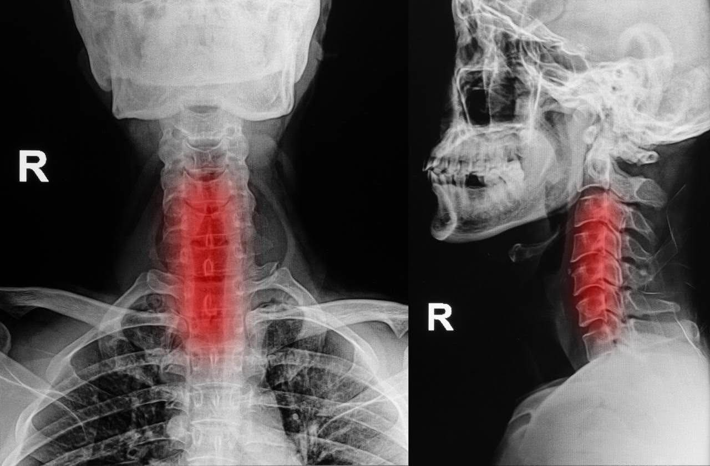
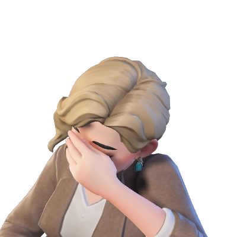

https://www.facebook.com/permalink.php?story_fbid=pfbid02aViZ56QCNnnVFvs42rNJ1DtFZdHmRvxRptfV48pFAxbzKXCbwVdvxFs8tm8aCotFl&id=100000489031315
<u>20 вересня 2025</u>
Цікавий випадок, який змусить вас задуматися, перш ніж похрумтіти шиєю.
28-річний американець за звичкою з хрускотом розім'яв шию. За кілька хвилин чоловік усвідомив: лівий бік його тіла перестав слухатись. Спробувавши дійти до телефону, він зрозумів, що рухається чітко по діагоналі. До лікарні його доправили вже майже повністю паралізованим.
То справді був інсульт, викликаний розривом хребетної артерії, яка забезпечує мозок киснем. Чоловік спочатку защемив судину, а потім різким силовим рухом розірвав її. Мозок перестав отримувати достатньо кисню, що призвело до втрати деяких функцій. Великий успіх, що лікарі встигли врятувати життя чоловікові.
Внаслідок інсульту інтелектуальні здібності пацієнта не постраждали, рух відновлено, але є проблеми з координацією лівої руки.

 
***
## Коментарі
Christina Sofyanick
Чого так делоко, а ж у Америку, є львівянин який таке зробив,таким хрустінням перетиснув судину в шиї, внаслідок інсульт мозочка, Слава Богу все добре.
Марія Іванівна Маловічко
 
Алла Протасова
Сова крутить теж головою то вчимось
Jeka Jackson
Так а что делать если она сама хрустит. ))
Жанна Радченко
Jeka Jackson от і я про це
Роман Павловський
розрив хребцевої артерії не призведе до інсульту...
компесаторні судини забезпечать мозок арт.кровью
Iryna Iryna
Я знаю невропатолога, який так крутить шию паціентам. У нього була всього один раз. Була дуже рада, що залишилась живою
Лідія Павлишин
Ок,а якщо відчуваєш,що тягне в шиї?
Так і хочеться «похрустіти»?
Галина Крук
 
Nataly Flower
Ніколи цього не розуміла, навіщо «хрустіти» шиєю. Знаю чоловіків, які вже залежні від цього. Дякую за інформацію
Жанна Радченко
Nataly Flower я так роблю, коли зажало шию, голова ніби сховалася в плечі. А коли порозтягувала вправами, воно хрустить і одразу стає легше
***
Моя думка.
Напевно, Роман Павловський (згідно анкети (профіль приватний) — завідувач амбулаторії) перечитав Карла Рокитанського та перебільшує компенсаторні можливсті організму, зокрема шиї,