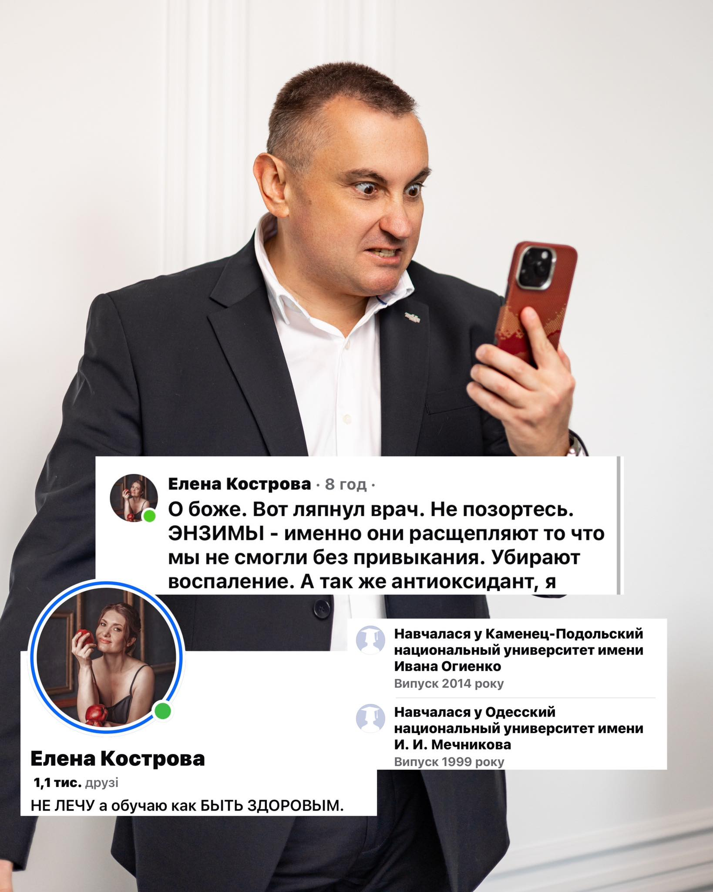

https://www.facebook.com/volodimir.ackiv.697856/posts/pfbid02D79jdjwbMtUNqsNwEfZ42twR4WxDQAm8SAD4tX7ajiUyJ54VDkAKozL6ZarwfeeYl?comment_id=758816863278365
<u>4 січня 2026</u>
Іноді я думаю, чи не варто вводити цензуру на медичні коментарі людей без медичної освіти 🤔. Не як обмеження свободи слова, а як елементарну гігієну інформаційного простору.

Коли людина з немедичною освітою дозволяє собі писати лікарю «не позорьтесь» і паралельно роздавати медичні оцінки на широку аудиторію — це вже не дискусія, а імітація експертності.

Ензими, запалення, антиоксиданти — це не слова з інтернету, а медичні терміни з чіткими випадками використання. Саме тому ними оперують лікарі після років навчання і практики, а не коментатори з гучним тоном і впевненістю у власній правоті.

Я не коментую чужі професії і нікого не вчу тому, чого не вивчав.

Медицина — не поле для особистих думок, а сфера відповідальності. Коли «лікують» у коментарях без освіти — страждає не лікар, страждає пацієнт.

Тому так, певна цензура тут була б доречною. Не для приниження, а щоб відрізняти знання від шуму.

 
***
## Коментарі
Валентин Добровольський
Так, ця хабалка впарює шарлатанські зілля коралового клубу в медичних групах. Сумно, що її за це не банять.
Іра Карманова
Валентин Добровольський Сумно, що люди ведуться на це, витрачаючи дорогоцінний час.
Валерій Туманов
Іра Карманова Аби тіко на це велись! Он в 2019му - повелись на голобородька, результат досі всі вихаркують, шкода що й ті - хто не повівся!
Dmytro Polansky
Валентин Добровольський Кораловий клуб це окрема пісня. Я колись сам на них присів, бо шукав порятунку і навіть з їхніми лікарями консультувався. Це звичайний бізнес і сєтєвуха, хоч їхня концепція, звісно, не без здорового глузду.

Владимир Демиденко
Не ну якщо ви та особа з медичною освітою що писала що прийом пробіотиків після антибіотиків це фарм пропаганда, то вибачте але це аж ніяк не проявляє вас як кваліфікованого медика скоріше навпаки, я не слідкую за вашими публікаціями але коли випадково прочитав вашу публікацію то я чесно був від написаного медиком в ступорі, якби не спробував на собі що таке коли в тебе протягом тижня вливають антибіотики без пробіотиків то може б і не писав би але на фоні пережитого мною ставлю під великий сумнів вас як фахівця, якщо що то я не медик а пацієнт)
Автор
Володимир Яцків
Владимир Демиденко ви абсолютно праві: я не ВАШ фахівець. Знайдіть будь ласка того, хто вам буде призначати пробіотики (завжди з антибіотиком), гепатопротектори (після прийому антибіотиків, почистити печінку), БАДи. Таких справжніх фахівців достатньо
Владимир Демиденко
Володимир Яцків Я сам собі можу призначити так що якось розберусь, за гепатопротектори не знаю нічого а з пробіотиками урок засвоїв на відмінно завдяки таким як ви " професіоналам"
Олександр Михайлович Савранський
Володимир Яцків колись читав, що один із найбільш продаваних препаратів на території бувшого СНД це був актовегин. Не вірив, зараз бачу мабуть правда((

Олександр Михайлович Савранський
Владимир Демиденко почитайте трохи про доказову медицину, почитайте чи використовуються пробіотики за кордоном
Владимир Демиденко
Олександр Михайлович Савранський Для чого мені читати? Я витратив рік життя на поновлення мікрофлори кишечника із за таких професіоналів, так що у мене досить гарна практика на своєму організмі. У вас ще питання є до мене? Якщо що то я по темі пробіотиків розкрию очі любому "профі")
Олександр Михайлович Савранський
Владимир Демиденко складно пояснити тому для кого все ясно, живіть собі далі, можна ще вивчити хірургію та самого себе оперувати, так щоб ніхто не нашкодив, бо кругом одні ж «профі» для вас
Владимир Демиденко
Олександр Михайлович Савранський на лікаря надійся але сам будь завжди готовий допомогти сам собі) Подивився на вашу сторінку наче б то лікар а таке несете що йде в розріз з тим що почуває і потребує пацієнт, так що бувайте здорові і не хворійте а то хто зна який "професіонал"буде вас лікувати)))
Олександр Михайлович Савранський
Владимир Демиденко хто тут несе і що мені теж зрозуміло, самолікуйтесь далі, до побачення
Владимир Демиденко
Олександр Михайлович Савранський Ну до вас і до того кого ви так вперто захищаєте точно не звернусь 200 відсотків, так що прощавайте а не до побачення і не мрійте)
Олександр Михайлович Савранський
Владимир Демиденко ахах😅
Ирина Галкина
Владимир Демиденко Ну правильно ,навіщо читати,простіше мати радянські переконання і срати на доказову медицину.А потім хаяти лікарів,що вони призначають непотрібні ліки.Я Вас розчарую,навіть якби ви пили разом з антибіотиком пробіотики,це не змінило би ваш стан.Ви хоча б логіку елементарну включили.Ви п'єте препарат,щоб вбити бактерії і при цьому п'єте бактерії.Але пийте,хто вам указ,гірше не стане і аптекам добре.
Владимир Демиденко
Ирина Галкина Ок якщо все так як ви стверджуєте то як ви поясните що при лікуванні антибіотиками я вже сам застосувував пробіотики через кожні дві години після введення антибіотика, і мікрофлора кишечника залишилась в порядку, антибіотики застосовувались внутрішньо венно на протязі 7 днів, а от при тому ж самому лікуванню тільки декілька років назад тільки без пробіотиків я рік поновлював вбиту мікрофлору? Так що не потрібно мені щось розказувати, якщо я все випробував на своєму організмі, і це не радянські переконання а сучасні якщо що, а аптекам по фіг що ви там купляєте чи антибіотики чи пробіотики для них головне аби на щось був попит і був товарообіг) Я вам ситуацію намалював роз'ясніть старому совку чому при одному лікуванню була вбита мікрофлора, а при іншому було все добре?

Lyuda Tuezova
Одна знайома говорила:треба іти до лікаря,але не знаю як вдягтися.Вдягнусь дорого,знайдуть хвороби,яких і близько немає.Вдягнусь бідно - ніхто і не гляне((((Отаке зараз відношення до хворих.Заробляють гроші для себе і фірми,в якій працюють.Часто призначаються непотрібні процедури,аналізи,дорогі ліки,хоч є аналоги дешевші.Стільки порушень в медицині,і в більшості це пов,язане з грошима.От люди і лікуються самі народними методами,і скажу вам,доволі успішно.
Vlad Gunyavy
Lyuda Tuezova так роботи після народної медицини у нас хоч відбавляй, а потім чому так дорого. Дешевше було б пару років назад...
Lyuda Tuezova
Влад Гунявий ситуації бувають різні,як і хвороби.Амосов,будучи професіоналом, і той говорив:меньше ходіть до лікарів!Ідіть тільки в крайньому випадку,дайте організму вилікувати себе самому.Змініть спосіб життя,займіться фізичними вправами.І це правда,яку неодноразово перевірила на собі.Але можу з вами погодитись тільки в плані онкозахворювань,тут час справді працює проти пацієнта,
Vlad Gunyavy
Lyuda Tuezova це дуже слизька тема... лор інфекція наприклад, я раніше не лікував проходило само, років три назад перестало, коли є проблєма потрібно відразу йти до лікаря. Коли болить зуб без причини потрібно йти до лікаря відразу. Є профілактичні огляди обов'язкові. Звісно коли в боку стрельнуло раз не потрібно нікуди бігти. Фізичні вправи мають дуже багато протипоказань. Коли людина яка пробухала 20 років , різко кинула пити і пішла в спорт зал. 90% це покійник....
Lyuda Tuezova
Влад Гунявий Профілактичні огляди...Флюорогафія може виявити,якщо знімки проглядає відповідальний лікар,хоч і тут не завжди все видно.В інших кабінетах тільки запитання:що турбує?А буває і не запитують,підписали та і все.А у нас чоловіки не звикли жалітися...Та справа і не в цьому.Кожна людина відповідає за себе сама,і за здоров,я теж.Як на підприємстві техніка безпеки.До кожного працівника охорону не поставиш.Повинен сам собі бути технікою безпеки,щоб залишится неушкодженим))) Людина не повинна сліпо довіряти як лікарям,так і народним цілителям.Все аналізувати,звернутися до інших і не лякатися зразу від озвученого діагнозу.У мене мати 15 років прожила після онко,потім знову виявили рак шлунку.Вийшла з лікарні після операції ніяка,втрачати було нічого.Почала пити мухомор.З,явився апетит,з,явилися сили,рум,янець на обличчі.І тільки раптова смерть сина(автомобільна аварія), спричинила її смерть...Померла не від онкології...але навіть на прикладі її життя.Це ще до її страшних діагнозів.Лежала в лікарні,де було призначено сильнодіючі ліки через крапельниці.Одна медсестра здивовано перепитала,чому їх так багато,адже більше 3 не призначають.Через короткий час з,явилася язва дванадцятипалої кишки.Лікувалася вже народними ліками.Зарубцювалася.На ногах з,явилися трофічні язви від вен (операції призначали все життя).Одна жінка дала рецепт,що робити з виразками.Спробувала,виразки затягнулися.Так і обійшлася без втручань.

Олександр Михайлович Савранський
З цим важко не погодитись. Але ж зараз час «експертів». Працює давно відомий закон- чим менше людина знає, тим вона впевненіше вважає що є знавцем. Це працює не тільки в медицині. Вузький світогляд та завищена самооцінка не завжди заважають рекламувати себе, а навпаки допомагають). А походу знецінити когось або образити, це запросто
Inna Sapozhak
Це варто робити, і в Європі (особливо в Німеччині), це жорстко дотримується, з великими штрафами за неправдиву інформацію!
Євгенія Бондар
Я думаю, за медичні коментарі або поради, які пишуть люди без медичної освіти треба вводити законне покарання. Намахав людину на БАДах, сідай до в'язниці і намахуй співкамерників.
Михайло Омельчук
Кострова, то ще той коментатор!
Lyubusya Lyubusya
Нашо нервувати на язичних неначитаних? - воно ж населеніє? Здоровʼя треба шанувати, язичні для мене то зразу ігнор ,вони пасивно - агресивні якісь фу
Victoria Stolpnik Gubko
Ензими, бішофіти, антиоксиданти і т.д - "розумні" слова з інфопростору, які люди розуміють на свій розсуд і вставляють там, де їм подобається
Vlad Gunyavy
Тут був би доречний блок на таке генетичне сміття...
Євген Луцишин
Аналогічно на політичні коментарі осіб без політологічної освіти:)
Лариса Ивановна
Так це не тільки в інтернеті. Сьогодні одна жіночка на зупинці писала "рецепта" зовсім незнайомій людині. Бо підслухала, як та розмовляла по телефону. Це жесть.
Dmytro Polansky
Тут незрозумілий контекст. Лікарі теж можуть ганьбитися, вони не всезнаючі, а деякі відверто тупі. Я сам лікар, але часто стикався з дуже обмеженими лікарями, деякі професори взагалі відверту маячню несли, тому це не завжди показник. Але зараз дійсно розвелося купу блогерів та нутріціологів, які знають ще менше і лише шкодять чи просто щось продають.

Коля Лемко
Тепер, як що ти бідний то не можеш доказати лікарю, що ти хворий!!! А як що багатий що ти здоровий!!!
Виктория Фалько
Уролесан теж фуфломіцин,який деякі камені і пісок виводить з нирок на 100%
Любовь Башкова
Прийдеться перечитати, що таке ензими. Крутиться в голові, як у Вєрки Сердючки: ензими, кузини, кюлони, купони, тампони, страпони... До болі знайоме )))
Oleksandr Stepanenko
Хто буде визначити що людина має медичну освіту
Лариса Ивановна
Oleksandr Stepanenko людина з медичною освітою не буде роздавати поради незнайомим людям в ФБ. Любий професіонал спочатку вислухає жалоби, запитає симптоми, назначить аналізи і не тільки, а лиш потім буде писати рецепт.
Дмитро Дмитро
Лариса Ивановна я б сказав навіть навпаки ,все ще гірше...людина з медичною освітою і досвідом точно поради не буде давати ,знаючи про можливі побічки і індивідуальні особливості.
Марія Белей
Дмитро Дмитро та де такий розумний а в кого ви лікуєтесь у баби яка на базарі трави продає???
Владимир Демиденко
Марія Белей якщо що то він не один такий я Дмитра підтримую на 100 відсотків, а вам би порадив залишити своє хамство для свого чоловіка, якщо він є у вас)

Марія Белей
Oleksandr Stepanenko диплом..
Oleksandr Stepanenko
Марія Белей диплом можна намалювати
Марія Белей
Oleksandr Stepanenko боже яке воно дурне ...

Oksana Zorka
Oleksandr Stepanenko медичний ВУЗ

Олег Заграничний
Іноді я думаю: А чи не відправити оцих всіх цензурщиків, типу Вас, до північної Кореї, або , хоча б, на московію....??
Після так званої "пандемії" я більше довіряю людям без медичної освіти, як так званим лікарям.
Бо більшість лікарів з освітою "запхали голову в пісок" і мовчали тоді коли треба було говорити, спираючись на свою медичну освіту.....!
І навіть зараз, коли так звана "зелена влада" ввела для лікування протоколи, більшість лікарів тупо мовчать.....
То як їх, отих дипломованих лікарів слухати, коли дефакто вони зараз не лікують, а лише призначають те, що їм написав, не відомо хто, в отих протоколах....?
Ирина Галкина
Олег Заграничний Протоколи були завжди.І завжди призначали по них.
Любовь Башкова
Олег Заграничний в останній час лікуюсь тільки по схемі: прийшла на першу консультацію в будь яку лікарню, часну чи не часну, заплатила гроші, познайомилася з лікарем. Залишила усі знімки , УЗІ, МРТ, попросила подивитися спокійно у вільний час. Без протоколу. Передзвонила через тиждень, отримала реальний результат)

Василь Фречка
В політиці, футболі і медицині розбирається будь яка кухарка
Галина Сащенко
А чого боятись якщо чесно працюєш.що камінь совість точить.
Paraskoviya Petriv Bobyak
😋🫢Навчалась в Трускавці!
Viktoria Melnyk
ВАРТО!!!!
Олена Олегівна
Дайте їй сто днів, вона научиться

Andrii Viuha
На мене колись пацієнтка поскаржилася, шо в неї голова болить, Я все послухав, а голову ніт)))) Неуважно поставивсі))))🤘
Надія Веремієнко
Andrii Viuha До нас в амбулаторію колись прийшла бабуся. У неї болів великий палець на нозі, там був якийсь гнійний процес. Хірурга у нас в штаті не було, терапевтка призначила загальний аналіз крові. Приготувала я все для забору крові й кажу бабці: ''Давайте палець...'' -- ''Звідкіля?" -- ''З руки.''. -- ''О, болить -- де, а колять -- де?! Ви тут нічого не понімаєте!" Встала й пішла. Залишилась без медичної допомоги.
Andrii Viuha
Надія Веремієнко ще був випадок нещодавно. Я узіст кардіолог в Канаді. Так ось одна пані написала на мене скаргу в міністерство, шо я недостатньо обстежив її. Серце подивився тільки з переду, а задню стінку не дивився. Вимагала аби я сканував ще і зі спини))))

Michajlo Dudych
ФБ це болото ,хочеш написати щось цікаве пиши в спільноту