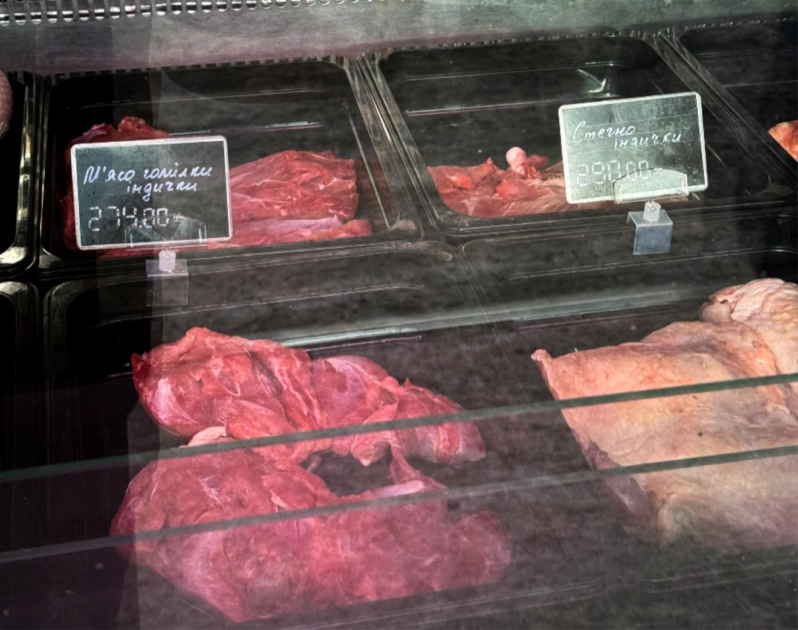

https://www.facebook.com/volodimir.ackiv.697856/posts/pfbid0tTKTcm1qooFpohuM3t7Ve9uJnW5nPfGtrAQQfcdzYfwriXuCSgtTZseHXD8NP43El
<u>11 січня 2026</u>
Скільки має коштувати консультація лікаря? 
Давайте для прикладу подивимось на прості і зрозумілі речі👇🏻
М’ясо гомілки індички — 274₴ за кілограм. Стегно індички — 290₴ за кілограм.
І от мені стало цікаво: а скільки насправді має коштувати консультація лікаря, якщо перевести її у щось максимально побутове — наприклад, у вагу м’яса.
На мою думку, не має значення, хто платить — держава за пацієнта чи сам пацієнт у приватній клініці. Якщо вже шукати логічні орієнтири, то вони можуть виглядати так.
✅ Консультація лікаря — 2 кілограми стегна індички.
✅ Консультація з елементарним обстеженням — 4 кілограми гомілки.
✅ УЗД однієї групи органів — не менше 2.5 кілограмів гомілки.
І знаєте, багато що у цьому житті дуже легко переводиться у простіші категорії 👇🏻
750₴ за манікюр — це нормально. 
750₴ за консультацію лікаря, який навчається роками, несе відповідальність і приймає рішення, що безпосередньо впливають на здоров’я і життя, — раптом стає «дорого»🤔
І тут у мене виникає просте питання: справа дійсно у ціні чи все ж у цінності?
***

***
## Коментарі
Lyudmyla Zaburko
Консультацію лікаря можна прирівняти також до оплати 1 год кваліфікованого інженера. Повірте в політехніці вчитися, напевно, не легше ніж в медичному - нарисна геометрія, теорія машин і механізмів, сопромат, деталі машин , вища математика, креслення, фізика ( електротехніка)- це обовʼязкові предмети, а ще так само як і в медичному - органічна хімія, аналітична хімія ( той самий кількісний і якісний аналіз), кристалографія і куча спеціальних дисциплін, курсові роботи, в яких 5-6 листів на ватмані , пояснювальні записки на 50-60 аркушів, дипломна робота на 10 листів на ватмані і записка пояснювальна на 100 аркушів.
Медикам треба зубрити і памʼятати, а інженеру ще мати математичне розуміння.
Лікар в поліклініці за 15 -20 хв має напрацьований протокол і від нього не відходить, тобто особливого підходу не потребується. Ніхто не має часу шукати причину, лікують симптоми.
Лікарі не Боги, одне і теж роблять в залежності на яких профілях спеціалізувались.
Питання щодо оплати праці хірургів - тут треба вирішувати розумно, бо ця праця дуже відповідальна.
Борис Рогожин
Lyudmyla Zaburko То навіщо ті лікарі терапевти? Має бути один на 50 тисяч. Який роздає ті Протоколи. Тим більше що пацієнт може ще звертатись за порадою до Інтернету! В аптеці поради ще нададуть. Без іронії - кваліфіковані. Поки що там є провізори.
Татьяна Кочерга
Lyudmyla Zaburko Найважчого навчання ніж в медакадемії не існує взагалі. Будова автомобіля і людського організму це 2 великі різниці
Lyudmyla Zaburko
Я вважаю навпаки, вивчити і запамʼятати може кожна людина, а ось математично розуміти і мати логічне мислення - не кожному дано. Тут не про автомобілі і не про будову людського організму і не про вірші - йдеться про інженера, який зайнятий на важливих проєктах.
Але ви все спростили до примітиву і претендуєте на доказовість.
Інженери винайшли медикам обладнання рентгенівське, УЗ, МРТ, КТ, радіодіагностичне …. І що медицина та і світ на сьогодні варті були би без інженерного оснащення?
Володимир Яцків
Lyudmyla Zaburko інженери народились на цей світ тому, що їх приймали на світ лікарі, у яких тоді не було ні МРТ, ні УЗД. Лиш знання і бажання допомогти породіллі 😄
Viktor Dytynko
Lyudmyla Zaburko не погоджуся, людина - не залізо, і не бетон
Iryna Hladun
Володимир Яцків інженери не хворіють?
Lyudmyla Zaburko
Роди - природній процес і колись ваша бабця родила без лікаря, а от мости і поїзди вже інженери будували. Ви дуже ідеалізуєте свій фах і я це розумію, бо життя і здоров’я найцінніший чинник нашого буття.
Але цим хизуватись і наголошувати кожного разу , на мою думку, не варто.
Ляма Дзу
Lyudmyla Zaburko хтось вилікувався з допомогою мрт,кт чи узд?тепер це метод лікування?Не хворійте
Lyudmyla Zaburko
З якою метою примітивно перекручуєте?
Без цього дослідження причина захворювання не зʼясовується. Але ви, очевидно, медик, це стиль вашої поведінки.
Наталя Минакова
Татьяна Кочерга але ж треба і літаки і обладнання медичне теж кому то робити. І не за 10000грн
Галина Ясько
Lyudmyla Zaburko а я б ще добавила хай отримує як молодий вчитель 100 грн на годину роботи з 25-30 учнями а не з однією людиною
Натали Чунихина
Lyudmyla Zaburko щоб застосовувати протокол, треба поставити діагноз, а без клінічного мислення це неможливо і набути його не легше, чим математичне!
Світлана Кравчук
Натали Чунихина Так, " продукт" роботи лікаря це діагноз, тільки правильно встановлений, дасть результат.
Світлана Кравчук
Lyudmyla Zaburko А хіба хтось знецінював роботу інженера в цьому пості? Йде мова про адекватну оплату праці.
Ляма Дзу
Lyudmyla Zaburko різниця в тому,що коли приходиш за проектом перебудови приміщення в бюро,де інженер отримує зарплату, не очікуєш,що він буде цей проєкт робити даром,бо йому вже йде зарплата .А з лікарів всі очікують 24/7 це і маніпулюють саме тими аргументами,які ви знецінюєте-найважливішим в світі-людським здоров'ям та життям
Ігор Новицкий
Lyudmyla Zaburko в політесі легше. В лбому випадку. Зламається машина і нічого страшного а тут на кону людське життя.
Lyudmyla Zaburko
Завалиться Ваш будинок чи вибухне газ у вашій будівлі - не одне життя піде по помилці.
Але я не про те.
Інженерія забезпечила сьогодні медицині можливість діагностувати, оперувати, лікувати, профілактувати.
Вважаю, що кожна спеціальність, професія важливі, а в інженерній справі крім запамʼятовувати треба ще мати дар до точних наук і дитині в 10-11 класі пояснити фізику, тригонометрію, хімію…
Розумієте про що я?
Давала собі слово не буду сперечатись, але не вийшло. Даруйте.
Marina Korchynska
Lyudmyla Zaburko жартуєте? Терапевтичні фахівці рятують від необхідності хірургічних втручань, то це менш кваліфікована праця? Не відповідальна. Ви на дуже розумна людина, якщо цього не розумієте.
Lesya Virstyuk
Lyudmyla Zaburko пані Людмило, безперечно інженер має мати достойну заоплатню.Але ж для чого потрібно принижувати чуже навчання, роботу і т.д.?
Треба було поступати в медичний, щоб розуміти суть.
І так-лікар-це знання, щохвилинна аналітика, величезна праця і відповідальність.
А пацієнтлві пофіг протоколи.Він хоче бути живий і здоровий.
Ну і про всяк випадокще 2 нюанси для роздумів:
- з любителів зубрити рідко виходять добрі лікарі, хоч анатомію таки приходиться завчити
- Тривалість навчання інженера 5 років, лікаря -10.

Якось так....
Діна Борисівна Комягіна
Lesya Virstyuk про кліничне мислення лікарів,живлюсь,ніхто вже і не згадує...а уе основа основ медицина і головна складність в розумінні. Інженери про це,мабуть, і не чули
Ляма Дзу
Lesya Virstyuk ви ж не поясните людині що таке клінічне мислення,бо це не про правильні формули та цифри.Правильний розрахунок можна побачити та перевірити,а лікування-то мистецтво
