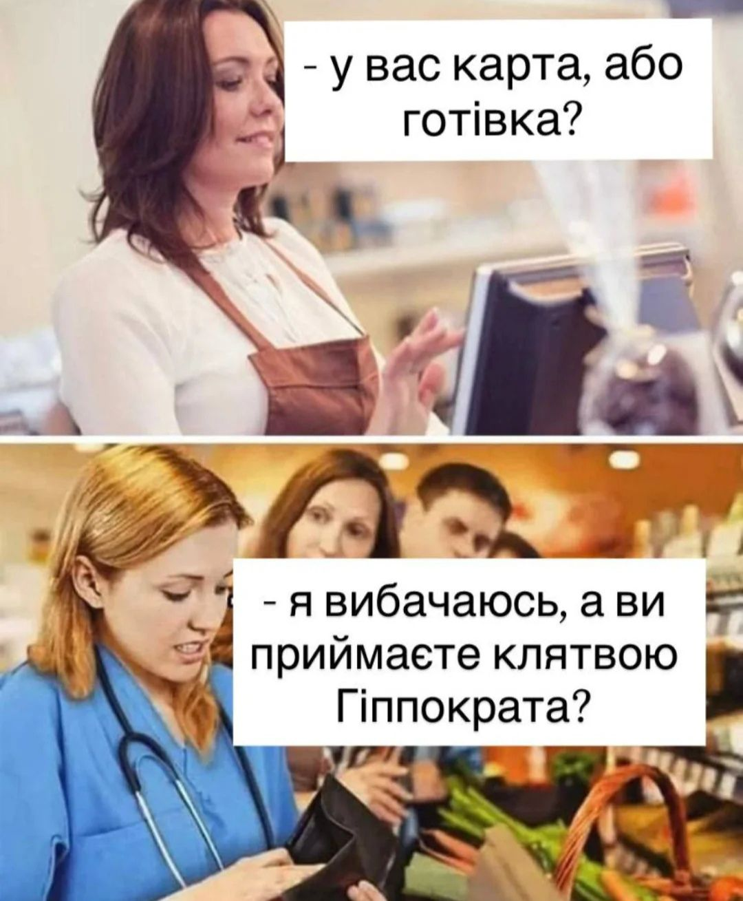

https://www.facebook.com/volodimir.ackiv.697856/posts/pfbid0tTKTcm1qooFpohuM3t7Ve9uJnW5nPfGtrAQQfcdzYfwriXuCSgtTZseHXD8NP43El
<u>11 січня 2026</u>
Скільки має коштувати консультація лікаря? 
Давайте для прикладу подивимось на прості і зрозумілі речі👇🏻
М’ясо гомілки індички — 274₴ за кілограм. Стегно індички — 290₴ за кілограм.
І от мені стало цікаво: а скільки насправді має коштувати консультація лікаря, якщо перевести її у щось максимально побутове — наприклад, у вагу м’яса.
На мою думку, не має значення, хто платить — держава за пацієнта чи сам пацієнт у приватній клініці. Якщо вже шукати логічні орієнтири, то вони можуть виглядати так.
✅ Консультація лікаря — 2 кілограми стегна індички.
✅ Консультація з елементарним обстеженням — 4 кілограми гомілки.
✅ УЗД однієї групи органів — не менше 2.5 кілограмів гомілки.
І знаєте, багато що у цьому житті дуже легко переводиться у простіші категорії 👇🏻
750₴ за манікюр — це нормально. 
750₴ за консультацію лікаря, який навчається роками, несе відповідальність і приймає рішення, що безпосередньо впливають на здоров’я і життя, — раптом стає «дорого»🤔
І тут у мене виникає просте питання: справа дійсно у ціні чи все ж у цінності?
***

***
## Коментарі
Lyudmyla Zaburko
Консультацію лікаря можна прирівняти також до оплати 1 год кваліфікованого інженера. Повірте в політехніці вчитися, напевно, не легше ніж в медичному - нарисна геометрія, теорія машин і механізмів, сопромат, деталі машин , вища математика, креслення, фізика ( електротехніка)- це обовʼязкові предмети, а ще так само як і в медичному - органічна хімія, аналітична хімія ( той самий кількісний і якісний аналіз), кристалографія і куча спеціальних дисциплін, курсові роботи, в яких 5-6 листів на ватмані , пояснювальні записки на 50-60 аркушів, дипломна робота на 10 листів на ватмані і записка пояснювальна на 100 аркушів.
Медикам треба зубрити і памʼятати, а інженеру ще мати математичне розуміння.
Лікар в поліклініці за 15 -20 хв має напрацьований протокол і від нього не відходить, тобто особливого підходу не потребується. Ніхто не має часу шукати причину, лікують симптоми.
Лікарі не Боги, одне і теж роблять в залежності на яких профілях спеціалізувались.
Питання щодо оплати праці хірургів - тут треба вирішувати розумно, бо ця праця дуже відповідальна.
Борис Рогожин
Lyudmyla Zaburko То навіщо ті лікарі терапевти? Має бути один на 50 тисяч. Який роздає ті Протоколи. Тим більше що пацієнт може ще звертатись за порадою до Інтернету! В аптеці поради ще нададуть. Без іронії - кваліфіковані. Поки що там є провізори.
Татьяна Кочерга
Lyudmyla Zaburko Найважчого навчання ніж в медакадемії не існує взагалі. Будова автомобіля і людського організму це 2 великі різниці
Lyudmyla Zaburko
Я вважаю навпаки, вивчити і запамʼятати може кожна людина, а ось математично розуміти і мати логічне мислення - не кожному дано. Тут не про автомобілі і не про будову людського організму і не про вірші - йдеться про інженера, який зайнятий на важливих проєктах.
Але ви все спростили до примітиву і претендуєте на доказовість.
Інженери винайшли медикам обладнання рентгенівське, УЗ, МРТ, КТ, радіодіагностичне …. І що медицина та і світ на сьогодні варті були би без інженерного оснащення?
Володимир Яцків
Lyudmyla Zaburko інженери народились на цей світ тому, що їх приймали на світ лікарі, у яких тоді не було ні МРТ, ні УЗД. Лиш знання і бажання допомогти породіллі 😄
Viktor Dytynko
Lyudmyla Zaburko не погоджуся, людина - не залізо, і не бетон
Iryna Hladun
Володимир Яцків інженери не хворіють?
Lyudmyla Zaburko
Роди - природній процес і колись ваша бабця родила без лікаря, а от мости і поїзди вже інженери будували. Ви дуже ідеалізуєте свій фах і я це розумію, бо життя і здоров’я найцінніший чинник нашого буття.
Але цим хизуватись і наголошувати кожного разу , на мою думку, не варто.
Ляма Дзу
Lyudmyla Zaburko хтось вилікувався з допомогою мрт,кт чи узд?тепер це метод лікування?Не хворійте
Lyudmyla Zaburko
З якою метою примітивно перекручуєте?
Без цього дослідження причина захворювання не зʼясовується. Але ви, очевидно, медик, це стиль вашої поведінки.
Наталя Минакова
Татьяна Кочерга але ж треба і літаки і обладнання медичне теж кому то робити. І не за 10000грн
Галина Ясько
Lyudmyla Zaburko а я б ще добавила хай отримує як молодий вчитель 100 грн на годину роботи з 25-30 учнями а не з однією людиною
Натали Чунихина
Lyudmyla Zaburko щоб застосовувати протокол, треба поставити діагноз, а без клінічного мислення це неможливо і набути його не легше, чим математичне!
Світлана Кравчук
Натали Чунихина Так, " продукт" роботи лікаря це діагноз, тільки правильно встановлений, дасть результат.
Світлана Кравчук
Lyudmyla Zaburko А хіба хтось знецінював роботу інженера в цьому пості? Йде мова про адекватну оплату праці.
Ляма Дзу
Lyudmyla Zaburko різниця в тому,що коли приходиш за проектом перебудови приміщення в бюро,де інженер отримує зарплату, не очікуєш,що він буде цей проєкт робити даром,бо йому вже йде зарплата .А з лікарів всі очікують 24/7 це і маніпулюють саме тими аргументами,які ви знецінюєте-найважливішим в світі-людським здоров'ям та життям
Ігор Новицкий
Lyudmyla Zaburko в політесі легше. В лбому випадку. Зламається машина і нічого страшного а тут на кону людське життя.
Lyudmyla Zaburko
Завалиться Ваш будинок чи вибухне газ у вашій будівлі - не одне життя піде по помилці.
Але я не про те.
Інженерія забезпечила сьогодні медицині можливість діагностувати, оперувати, лікувати, профілактувати.
Вважаю, що кожна спеціальність, професія важливі, а в інженерній справі крім запамʼятовувати треба ще мати дар до точних наук і дитині в 10-11 класі пояснити фізику, тригонометрію, хімію…
Розумієте про що я?
Давала собі слово не буду сперечатись, але не вийшло. Даруйте.
Marina Korchynska
Lyudmyla Zaburko жартуєте? Терапевтичні фахівці рятують від необхідності хірургічних втручань, то це менш кваліфікована праця? Не відповідальна. Ви на дуже розумна людина, якщо цього не розумієте.
Lesya Virstyuk
Lyudmyla Zaburko пані Людмило, безперечно інженер має мати достойну заоплатню.Але ж для чого потрібно принижувати чуже навчання, роботу і т.д.?
Треба було поступати в медичний, щоб розуміти суть.
І так-лікар-це знання, щохвилинна аналітика, величезна праця і відповідальність.
А пацієнтлві пофіг протоколи.Він хоче бути живий і здоровий.
Ну і про всяк випадокще 2 нюанси для роздумів:
- з любителів зубрити рідко виходять добрі лікарі, хоч анатомію таки приходиться завчити
- Тривалість навчання інженера 5 років, лікаря -10.

Якось так....
Діна Борисівна Комягіна
Lesya Virstyuk про кліничне мислення лікарів,живлюсь,ніхто вже і не згадує...а уе основа основ медицина і головна складність в розумінні. Інженери про це,мабуть, і не чули
Ляма Дзу
Lesya Virstyuk ви ж не поясните людині що таке клінічне мислення,бо це не про правильні формули та цифри.Правильний розрахунок можна побачити та перевірити,а лікування-то мистецтво
Руслан Верещак
Я вже разів сорок казав і скажу ще: - Всі професії діляться на дві категорії. Друга- всі інші, а перша- медицина! Всі повинні оплачуватися дорого, а медицина- супер дорого. І настане щастя...
Любов Панченко
Руслан Верещак Браво!Умничка!Коментар розумної людини.
Peeva Ania
Руслан Верещак тільки так і не по іншому !!!!
Vsevolod Vsevolod
Руслан Верещак ви трошки забули вчителів. Чи лікарі самотужки опанували медицину? Вчителі - єдина професія, яка створює фахівців усіх інших професій. Лікарів - теж.
Руслан Верещак
Vsevolod Vsevolod , лікаря навчити може, тільки, інший лікар. Як тримати скальпель і що таке цефтріаксон не вчитель математики навчить. І коли в людини срачка 4 дні ( діарея по розумному), то не до викладача алгебри йдуть. І немовлят в родзалі з людини жіночої статі дістає акушер- гінеколог, а не вчитель історії... Професія вчителя важлива, дуже, важлива. Але професія лікаря-- життєво необхідна!
Vsevolod Vsevolod
Руслан Верещак ще раз ... Навчити лікаря може тільки ВЧИТЕЛЬ. У медичних вузах викладають вчителі - лікарі. У консерваторіях - вчителі-музиканти. Вчать усьому необхідному. Наприклад тримати смичок. Вчителі-лікарі вчать усьому необхідному. У тому числі - тримати скальпель. Чи ви навчались тільки у операційній? А хірург-наставник, вірогідно, з іншої планети.
Руслан Верещак
Vsevolod Vsevolod , окей, окей.. Вчитель... Не нервуйтесь..
Скрипчук Роксолана
Vsevolod Vsevolod ну про що ви пишете зараз? Практики ніколи не навчить вчитель. Вчителі-лікарі зазвичай немають взагалі практики. І те, що тебе вчать ці «вчителі» найчастіше застаріла інформація.
Ви пишете про скальпель, як його може навчити тримати вчитель, який не проводить операцій?)
Всі лікарі справжні практичні і частково теоретичні знання отримують від лікарів наставників, а не викладачів)
Vsevolod Vsevolod
Скрипчук Роксолана ви, здається, не розумієте, що читаєте. Ок, лікарі ні у яких вчителів не вчаться. Вони сюди одразу з необхідним набором знань та навичок засилаються з центру Чумацького шляху. Й на нашій грішній Землі складають особливу, вищу касту. Неодмінно повідомлю про це усім знайомим лікарям. А їх у мене дуже багато. Й найвищих кваліфікацій. Є й всесвітньо відомі... Чомусь вони весь час розповідають, де й у кого навчались... Мабуть, не знають про Чумацький шлях.
Laura Parsehian
Не памʼятаю хто це сказав- але рівень держави вимірюється не багатством еліт, а становищем лікаря, вчителя й судді. Та поки що тільки суддям пощастило

Юліана Попова
Я думаю питання у цінності послуг, чомусь м ясо вважають ціннішим за здоров я, хоча моя думка, здоров я- безцінне !!!!! Моя мама віддала все життя медицині, я бачила цей колосальний труд і мізерну зарплату, нічні зміни та зневага від керівництва. А в кінці загинула від коронавірусу під час взяття аналізів у реанімації у 2021 році. Похоронили і того ж дня забули, нічого не дали, навіть грамоту. Висновок- лікарі і медсестри розхідний матеріал в нашій медичній системі, тому лікарі і медсестри повинні самі поважати свій труд і нікому не дозволяти їх принижувати чи обесцінювати.

Olha Urbas
Юліана Попова це нажаль не поодиноко і тотально, особливо навіть у вузькій медичній спільноті
Юліана Попова
Olha Urbas дякую за відповідь.Гарного здоров я!!!!

Оля Олійник
Юліана Попова не можна порівнювати лікаря з медсестрою Це приниження гідності лікаря
Наталя Минакова
Юліана Попова проєктувальники та будівельники літаків теж вкалують. Ви просто думаєте що тіки лікарі працюють. Треба усім достойні зарплати. Будуть більше податки. І бюджетникі зможуть більше отримувати. І на подяки вистачить

Vitalii Matusevych
Робити нігті- вдихати формальдегіди, отруту, пил від нігтьової пластини та ріжучого інструменту..,- ще те задоволення. Більше " кайфу" у стоматолога і патологоанатома, якщо говорити про шкідливість. От тому консультація лікаря, як і робота манікюру чи перукаря по 750 грн за прийом- цілком нормально. А от послуги стоматолога вже значно вартісніші. Лише будівельників за людей не хочуть мати, матеріал дорогущий, робота одна з найшкідливіших, гірше лише у шахтарів, а от оплата праці чомусь мало не за так, най за хліб працюють. Нормально харчуватися, мати норм. умови і характер праці та відпочинку, повинні як лікарі, так і перукарі. Скільки здоров'я за день втрачає той же маляр? То чому він має жити гірше, його життя і так буде коротким і закінчиться раком. І питання тут не в тому, хто як і скільки вчиться, мірилом зп має бути втрачене здоров'я за одиницю часу. Зварювальник працює в шкідливих умовах, небезпечних, холод... Вчиться кілька років, а опісля відточує навик. То чому його життя має бути меньше забезпеченню ніж мера містечка, який в якісних умовах " думає" за свою громаду, а по факту власний достаток. Без двірника нас поглине сміття, а без президента можна жити значно довше, з не меншим комфортом, а більшість не відчує відсутності гаранта, зате бруд навколо аж бігом
Александр Зубр
Vitalii Matusevych порівняти муляра і лікаря - це геніально.
Vitalii Matusevych
Александр Зубр муляр і маляр не люди? Лікарні лікарі власноруч будують, бо вчилися довго. Все навколо зведене руками будівельників, вони що, не люди. І повинні лише боби їсти. Муляр лишає на роботі не меньше власного здоров'я, спина та м'язи з суглобами... Вам лікар збудував житло? Поки лікар вчився, той таки зварювальник відточував до автоматизму порух руки, щоб шов був заповнений, герметичний, рівний, міцний та естетичний, і стільки вдихнув всього, що тих же років 8 власного життя втратив. Умови і характер праці повинні визначати рівень зп. На бурових вахтовик, що щохвилини ризикує лишитися без пальців чи рук повинен їсти боби? Лише лікар м'ясо. Так без того вахтовика авто лікаря не заведеться, щоб він до роботи доїхав. Не говорячи про те, скільки всього виробляють з нафтопродуктів
Александр Зубр
Vitalii Matusevych "здесь мерилом работы считают усталость..." Всем ПОХЕР на условия работы. Не нравится - уходи. Ценится результат. Остальное не волнует.
Галина Коваль
Vitalii Matusevych всі професії важливі і всі є людьми, незалежно від професії, але в оплату праці враховуються витрачені ресурси. Будинок, збудований за 8 років, в який вкладено працю сотень інших (освіта лікаря) і будинок зведений за кілька тижнів (курсів манікюру) коштують абсолютно різну ціну, не кажучи про ціннісність.
Светлана Николаенко
Александр Зубр коли " екстрено " звертаються в лікарню, таких ідей вже не мають в голові!)
Mykola Smykovskyi
Александр Зубр маляр заробляє набагато більше

Віта Гричка
Vitalii Matusevych з такими висновками, лікуйтеся в манікюрниці,муляра і двірника......ще забули про дуже шкідливу професію асенизатор,з нього можете почати.....вони несуть колосальну відповідальність за життя людини .....
Vitalii Matusevych
Віта Гричка то най лікарі самі сантехнічні проблеми вирішують, за вашою логікою. Є вплив на здоров'я, а отже це і є мірило оплати праці. Чим лікар краще інжннера-проектанта. Там теж відповідальності не менше. Двірник- це не людина, виходить. Най лікар і лікарні зводить самостійно, він же 8 років вчився...
Mariana Fedechko
Vitalii Matusevych , тобто ви вважаєте, що лікар повинен отримувати найнижчу зарплату, якщо він не підмітає вулиці чи не будує самостійно лікарні?
Віта Гричка
Vitalii Matusevych де ви бачили написане, муляр чи маляр ,то не людина ? Тупе порівняння у таких як ви ,та що там тої науки 8 років, пришити ті пальці без яких залишиться ваш буровик, зможе нафтовик, зробить операцію на серце муляр,прооперує непрохідність і виведе кишку вахтовик, поставить трахеостому двірник,зробить операцію на оці будівельник, під час зупинки серця,невідкладну допомогу надасть рибак,постентує й відновить кровотік до серця двірник,інтубаційну трубку в трахею - доярка, назогастральний зонд чи шлунковий катетер поставить ремонтник пральних машин, фгдс чи колоноскопію ,шахтар, аналізи різної складності - слюсар,......ой та що там той медик робить ,та що там він вміє,ойййййц та яка то відповідальність,та нема в них серця,та то черстві, залізні роботи, обслуга, ніякого стресу та вигорання та де там ,та то таке як три пальці обістяти "вченим"коментаторам.......

Mariana Fedechko
Vitalii Matusevych , якщо вже говорити про шкідливість професії, то ви забули про нічні чергування лікарів, після яких на все життя порушується режим сну, ризик заразитися інфекційним захворюванням, деколи смертельним, постійний стрес, який не відпускає ніколи: ні після закінчення робочого дня, ні у відпустці... Ще перерахувати?
Vitalii Matusevych
Mariana Fedechko я про це не забув, але та ж манікюрниця вдихає канцероген весь час і пил, втрачаючи безповоротно об'єм легень, як і перукар, легені котрої забиті частками волосся. Всі втрачають здоров'я на роботі. Але це не значить, що лише лікарі повинні мати гідну оплату праці, бо вони вчилися 7-8 років і продовжують вчитися. МНСники теж вчилися і продовжують вчитися і щоразу ризикують життям. То чому одним лише боби, а іншим м'ясо. Бо хтось думає, що його робота престижніша від інших. Нічні зміни на виробництві не меньше прискорюють інсульт та інфаркт, порушуючи режим сну. Додайте постійний шум, пил, вібрації... То оператор лінії не заслужив на м'ясо, лише на боби? Проблема не в тому, що лише лікарі отримують нікчемну зп, а всі в цій країні лише витратний матеріал, ресурс... Людина не є пріоритетом. А сперечатися про престижність і шкідливість професій можна довго. Без того ж будівельника не було б тих таки лікарень і житла, але лікар чомусь інтелігент, а будівельник- алкозалежний, що в ієрархії трохи вище безпритульного. Чим вчитель менш інтелігентний за лікаря? Лише роками навчання? Чи фізик-ядерщик не так важко вчився, як медик? Чи у цивільного пілота меньше відповідальності за людські життя?
Mariana Fedechko
Vitalii Matusevych , наскільки я зрозуміла, для вас лікар стоїть на найнижчій сходинці у списку професій. Ну-ну
Светлана Николаенко
Vitalii Matusevych чого Ви хвилюєтесь?
ШІ скоро всіх вилікує, правда з помилками, та операцію не зробить!)
Але то таке!)
Леся Лис
Mariana Fedechko А пожежники, рятувальники , пекарі чи шахтарі , вони не не працюють ночами ? А скільки ночей кравчині не досипають щоб заробити п'ять копійок (ну що там шити, два шви) бо бачите та ж медсестра забула про примірку чи захотіла обновку за два дні до дефіляди . Відмінність є між тим усім , ніхто крім медиків не має хабарів . Може якби пожежник , не діяв миттєво в чекав на хабар , чи будь хто інший , може б тоді не виникало дискусій . А пожежника ще й покарають як би що , в от лікарську помилку колега прикриє , земля приховає . Тут тільки суд Божий , на відміну від інших , в кого і умови праці гірші і ризики вищі і відповідальність більша за все . Єдине що справді має бути , то дійсно гідно оцінена праця усіх в залежності від багатьох чинників. В на сьогодні лікарі і депутати - ну народ , та за своє вже не коротке життя зустріла трьох Лікарів ( саме так з великою букви) яких скільки жити буду буду згадувати в молитвах, хай вони і не знають про то . А іншим просто бажаю отримувати сторицею те що несуть в світ .
Mariana Fedechko
Леся Лис , ой, тільки не треба про пожежників, які не беруть хабарів: протипожежні перевірки - їх головний дохід. І взагалі, їдять лікуватися до кравчині.

Павло Цибульський
Vitalii Matusevych ви оце серйозно??? Ви реально не розумієте, яку відповідальність бере на себе лікар та манікюрниця, муляр, двірник??? ви порівнюєте ціну консультації лікаря та манікюр і вважаєте, що вони тотожні, тоді середній та молодший персонал( медсестри, санітарки) мають безоплатно працювати?
Галина Коваль
Vitalii Matusevych пане Віталію, Ви так детально розписали, що Ваша соціал-комуністична позиція ясна (інтелект не важливий, освіта теж, оплата визначається складністю фізичної праці).
Коли за красиві нігті Ви призначили таку ж ціну як за здоровʼя, не здивувалась, бо багатьох зустрічала із бездоганним манікюром, але запущеним здоровʼям.
Але коли Ви роботу стоматолога оцінили вище ніж інших лікарів, то я хотіла уточнити - з вашої позиції стоматолог важче працює, бо стоячи зігнутий і пил вдихає (пробачте, колеги) чи зуби важливіші за серце, мозок чи печінку?
Бо так гарно почали про важливість всіх професій, а якось так виходить що в тілі людини найважливіші нігті і зуби.
Навіть не смію питати Вашу позицію стосовно оплати праці за інтелект науковцям-розробникам всього, чим користуються і завдяки чому заробляють у всіх професіях.
Светлана Николаенко
Галина Коваль здається , там " прогноз несприятливий"!)

Ольга Вірич
Лікар завжди може бути маляром,маляр ніколи не буде лікарем
Наталя Минакова
Не лікарю треба теж вивчитися та відпрацювати приблизно один день щоб віддати свою зарплату на консультацію Все менше ходять по лікарням. Тому їх і закривають. Приватні клініки на кожній зупинці транспорту. Черг немає. А треба ж оплатити там і комунальні і звязок і адміністраціі. Ось і така ціна на консультацію.

Ляма Дзу
 
Володимир Яцків
Ляма Дзу бомба. Можна я це опублікую?
Ляма Дзу
Володимир Яцків звичайно!Будь ласка!

Борис Рогожин
Ляма Дзу Гіпократу вчив що без належної оплати лікар не має права лікувати. Тому що пацієнт буде зверхньо ставитись до його порад, їх не виконувати і тим самим наносити самому собі шкоди. Тому ...так.

Svitlana Yatskevych
А тим, хто не може дозволити витрачати кошти на манікюр , можна не лікуватися?
У лікарів відповідальна і складна робота, але порівнювати це кг м'яса це некоректно . Всі живі істоти хочуть їсти. Можна мати якіснішу машину, техніку, будинок, прикраси. Але їжа має бути доступна кожній людині.
Чи може медична сестра дозволити собі лікування, м' ясо!?Коли двоє дітей в сім'ї, незавжди маєш кошти, щоб купити собі навіть антибіотик. А коли хворіє дитина, ходиш в прохудалому взуті і штопаній курточці.
Вже бісить. Яке люди мають відношення до справедливої оплати праці лікарів та інших професій. Треба не з людей душу виймати, які не можуть дозволити собі лікування і п'ють жменями знеболювальні, щоб заробити собі і дітям на їжу, житло а приймати якісь дії. Жоден лікар не вийшов на бастування, не прийшов на сесію верховної Ради. Жоден лікар не підтримав медичних сестер, коли вони намагалися достукатися до товстосумів з верховної Ради.
Скільки повина кілограмів м'са отримувати медична сестра? Якщо медицина, це перша ланка серед професій і кому задати це питання?
Що тільки не придумають, щоб писали коментарі.
Є лікарі, які дійсно відповідально відносяться до своєї роботи, а є які під ногами землі не відчувають і можуть послати, вибачте, нахрен. І якщо вчора було 18 років, а сьогодні 19, то ти дивом стаєш дорослим за одну ніч і повинен зубами вигризати собі життя.
Володимир Яцків
Svitlana Yatskevych так багато тексту, цілий біль за лаштунками. А ви уважно прочитали допис? Точно??
Там вказано: НЕ ВАЖЛИВО, хто платить… і далі по тексту. Ви знаєте скільки НСЗУ оплачує за консультацію фазхівця? Спочатку дізнайтесь, а потім витрачайте нерви.
Svitlana Yatskevych
Володимир Яцків нажаль знаю. І до того, що відноситься к медицині, я завжди уважна!!! Але цей пост не для НСЗУ а для пацієнтів. Чи не так? Що не по темі написано в моєму тексті?
Що стосується вашого коментаря стосовно болю, дайте відповідь, за які кошти лікувати дітей, якщо одна доза ліків коштує 55 000? Якщо за два місяця на лікування, обстеження, консультації тільки одного члена сім'ї витрачається більше 100 тисяч гривень. А медична сестра отримає максимум 10 000 гривень.

Володимир Яцків
Svitlana Yatskevych не сприйміть це як знецінювання. Я переглянув ваш профіль - у мене не склалось враження, що ви медик. звідки ви можете знати, скільки оплачує НСЗУ?
НСЗУ оплачує консультацію лікаря-спеціаліста за базовим тарифом 155 грн, який множиться на коефіцієнт класу послуги. Для більшості консультацій спеціалістів використовується клас 1,29, тому орієнтовна оплата за одну консультацію становить 155 × 1,29 ≈ 200 грн.
Це норма?
Svitlana Yatskevych
Володимир Яцків в мене 15 років медичного стажу. Але нажаль я не можу зараз працювати там, де дійсно мені подобається. А вимушена вибирати між роботою, яка подобається і роботою,де можна заробити на лікування. Ще і втрачати своє здоров'я. Я поважаю лікарів і їх працю. Але повага завжди повина бути взаємною і не вимірюватися доходами пацієнта.
Svitlana Yatskevych
Володимир Яцків це питання треба задавати тим, хто робить цей розрахунок. Треба об'єднуватися і боротися за свої права з тими, хто знайшов кошти у бюджеті для себе , на підвищення заробітної плати у 2026 році.

Лариса Чайка
Оплата має бути за результат. Я знаю одне, гарний фахівець бідувати не буде. Мій дідусь мав 12 дітей, мав своє ремесло ( в якому був найкращим), то борщ в них завжди був зі свіжим м’ясом. Знаю лікаря- супер фахівця , яка постійно опановує новітні технології, за границею проходить навчання, то вона завжди випромінює радість і задоволення. І знаю зовсім молодого травматолога в поліклініці, який не задоволений зп і не має бажання працювати…
Михайлина Александер
Лариса Чайка Так на жаль є і в нас...
Ляма Дзу
Лариса Чайка хто чоловік у тої суперфахівчині?Може саме він і оплачує її навчання,а молодий лікар за зарплатню в поліклініці за кордон на стажування не поїде
Лариса Чайка
Ляма Дзу ваше мислення примітивне. Та супер лікар все здобула супер працею, і теж починала з поліклініки ( я знаю її ще з тих пір), а мотиватор- любов до фаху і бажання удосконалення. А того молодого травматолога, мені його щіро шкода і його пацієнтів, турбує лише зп. Мій батько був супер фахівець, ( для примітивних осіб- крутив гайки)бо займався улюбленою справою, то в часи Союзу йому давали зразу 3-х кімнатну кв, а інші чекали по 20 роківв. Любіть свою справу, пані, і ви будете щаслива і справа корисна. Бо не в грошах щастя!
Лариса Чайка
Ляма Дзу ну, і ще наведу один приклад: маю знайомого - айтишник, заробляв гарні гроші ( бо знов- був «вище» за інших), придбав все, що хтів, через 5 років праці стало не цікаво…і його здобутки не робили його щасливим.
Ляма Дзу
Лариса Чайка примітивно вважати,що на зарплату лікаря поліклініки вам доступні закордонні стажування

